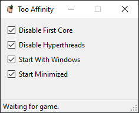
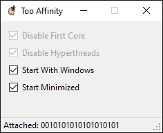

# Too Affinity

## Installation

- Move Too.Affinity.exe somewhere
  - I keep mine in C:/apps/Too.Affinity.exe
- Run
  - Once you have checked "Start With Windows" and "Start Minimized," you will never have to think about this program again.

## Features

- Disabling first core for CS
- Disabling hyper threads for CS

## Explanation

I was using Process Lasso to set my process affinity for CSGO. My trial ran out so I wrote a minimal replacement. This great video by 3kliksphilip explains why one might use Too Affinity.  
[Video](https://www.youtube.com/watch?v=QTf--p9Ckuk)
